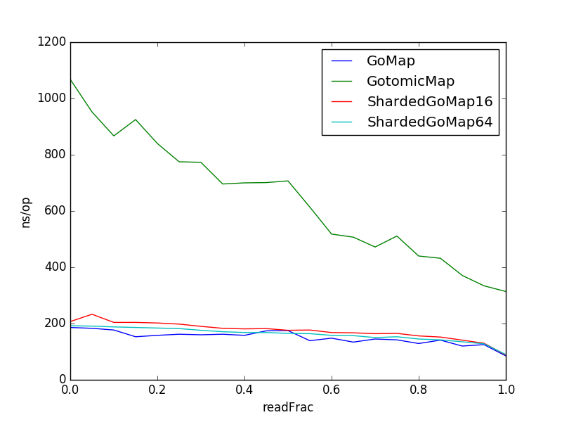

Note that `ShardedGoMap64` means we have 64 shards of standard Go maps.

Here is what each setup is trying to measure.

* Control2: Two `rand.Uint32` calls.
* Control5: Five `rand.Uint32` calls.
* BenchmarkRead: Concurrent read. Subtract timings by Control.
* BenchmarkWrite: Concurrent write. Subtract timings by Control2.
* BenchmarkReadWrite: Concurrent read/write. Probability of reading is readFrac.


To run the test, do

```
go test -bench=. | tee results.txt
```

# Sample results

In theory, you should subtract the time taken to compute the random integers.

For example, for `BenchmarkRead`, GoMap takes 131-59.4ns while GotomicMap takes
163-59.4ns, which is 1.45X slower. (2X slower means it takes twice as long.)

For example, for `BenchmarkWrite`, GoMap takes 320-116ns while GotomicMap takes
867-116ns, which is 3.68X slower.

```
BenchmarkReadControl-8       	30000000	        59.4 ns/op
BenchmarkWriteControl-8      	20000000	       116 ns/op
BenchmarkRead/GoMap-8    	10000000	       131 ns/op
BenchmarkRead/GotomicMap-8         	10000000	       163 ns/op
BenchmarkRead/ShardedGoMap8-8      	10000000	       125 ns/op
BenchmarkRead/ShardedGoMap16-8     	10000000	       126 ns/op
BenchmarkRead/ShardedGoMap32-8     	10000000	       124 ns/op
BenchmarkRead/ShardedGoMap64-8     	10000000	       124 ns/op
BenchmarkWrite/GoMap-8             	 5000000	       320 ns/op
BenchmarkWrite/GotomicMap-8        	 2000000	       867 ns/op
BenchmarkWrite/ShardedGoMap8-8     	 5000000	       300 ns/op
BenchmarkWrite/ShardedGoMap16-8    	 5000000	       291 ns/op
BenchmarkWrite/ShardedGoMap32-8    	 5000000	       286 ns/op
BenchmarkWrite/ShardedGoMap64-8    	 5000000	       283 ns/op
```

# Plot

Consider BenchmarkReadWrite. Vary `readFrac` and plot the time per op (subtracted
by control value).


